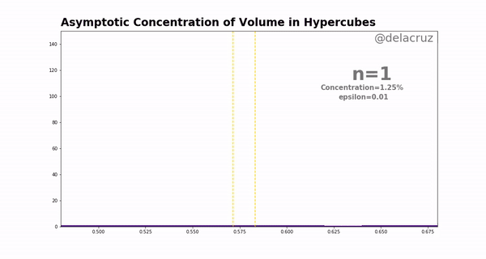

# Concentration of Volume
A collection of code and visualisation related to the MATH40008 Poster Project on Concentration of Volume. 

MATH40008 is a module all first year maths undergraduates at Imperial College London take after completing their summer exams. They are expected to construct a poster and give a presentation on a topic related to one of the five main topics provided by the department via independent research. Concentration of Volume falls under 'Law of Large Number and The Central Limit Theorem' and we will see how they play a role in proving the asymptotic concentration of volume in hypercubes.

  

